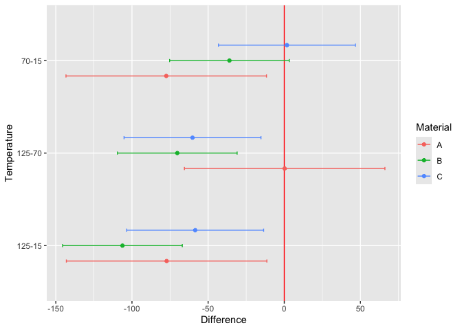

<!-- README.md is generated from README.Rmd. Please edit that file -->

# adas.utils

<!-- badges: start -->
<!-- badges: end -->

The goal of adas.utils is to provide some utility functions to be used
in the course *Analysis of Data and Statistics* at the University of
Trento, Italy. Course contents are on
<https://paolobosetti.quarto.pub/ADAS/>.

## Installation

You can install the development version of adas.utils from
[GitHub](https://github.com/) with:

``` r
# install.packages("devtools")
devtools::install_github("pbosetti/adas.utils")
```

## Examples

### Loading data sets

On <https://paolobosetti.quarto.pub/data.html> there are a list of
example datasets to be used during the course. You can load them with
the `examples_url` function:

``` r
examples_url("battery.dat") |> read.table(header=T) |> head()
#>   RunOrder StandardOrder Temperature Material Repeat Response
#> 1       34             1          15        1      1      130
#> 2       25             2          70        1      1       34
#> 3       16             3         125        1      1       20
#> 4        7             4          15        2      1      150
#> 5        8             5          70        2      1      136
#> 6        1             6         125        2      1       25
```

### Chauvenet’s criterion

The Chauvenet’s criterion is a method to identify possible outliers in a
sample. Here is an example:

``` r
x <- rnorm(100)
x[50] <- 10
chauvenet(x)
#> Chauvenet's criterion for sample x
#> Suspect outlier: 50, value 10
#> Expected frequency: 1.42479894534883e-10, threshold: 0.5
#> Decision: reject it
```

### Daniel’s plot

Daniel’s plot is a QQ plot of the effects of a non-replicated factorial
model. Here is an example:

``` r
daniel_plot(lm(Y~A*B*C*D, data=filtration))
```


### Pareto chart

The `pareto_chart` function is a generic function taht creates a Pareto
chart either from a general data frame or from the effects of a `lm`
object. Here is an example:

``` r
library(tidyverse)
#> ── Attaching core tidyverse packages ──────────────────────── tidyverse 2.0.0 ──
#> ✔ dplyr     1.1.4     ✔ readr     2.1.5
#> ✔ forcats   1.0.0     ✔ stringr   1.5.1
#> ✔ ggplot2   3.5.1     ✔ tibble    3.2.1
#> ✔ lubridate 1.9.3     ✔ tidyr     1.3.1
#> ✔ purrr     1.0.2     
#> ── Conflicts ────────────────────────────────────────── tidyverse_conflicts() ──
#> ✖ dplyr::filter() masks stats::filter()
#> ✖ dplyr::lag()    masks stats::lag()
#> ℹ Use the conflicted package (<http://conflicted.r-lib.org/>) to force all conflicts to become errors
set.seed(1)
tibble(
  val=rnorm(10, sd=5),
  cat=LETTERS[1:length(val)]
  ) %>%
  pareto_chart(labels=cat, values=val)
```



``` r

# For a linear model:
pareto_chart(lm(Y~A*B*C*D, data=filtration))
```


# Author

Paolo Bosetti, University of Trento
